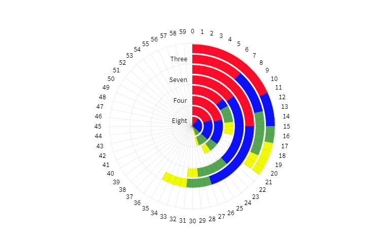

# Qliksense Radial Bar Chart Extension using amCharts.

## Introduction

This is qliksense radial bar chart extension I have created using [amCharts](https://www.amcharts.com/) javascript library. I have also add some custom settings so qlik user can customize and mess around to original amcharts API to have desirable custom effects.
 
Please rate & give feedback! If you want to contribute feel free to message me on github.

#### Chart Custom Settings
#### Path to custom settings: Appearance > Chart Custom Settings
- Custom ValueAxis Min/Max : Checkbox to enable add custom Min and max valueAxis.
- Min : Set Minimum value for value axis (default value = 0).
- Max : Set Maximum value for value axis (default value = 500).
- Measure 1 Color : Changes color of 1st measure's value bar.
- Measure 2 Color : Changes color of 2nd measure's value bar.
- Measure 3 Color : Changes color of 3rd measure's value bar.
- Measure 4 Color : Changes color of 4th measure's value bar.
- X Axis Cursor : Enable and disable x axis cursor.
- Y Axis Cursor : Enable and disable y axis cursor.

## Screenshots
### Demo

### Settings

## Disclaimer
I'm in no way affiliated with amcharts.com. Their library is free to use for commercial purposes with the caveate that you must include the link to their website in the charts. 